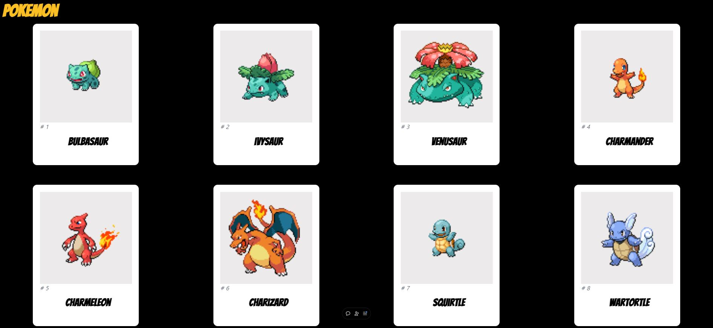
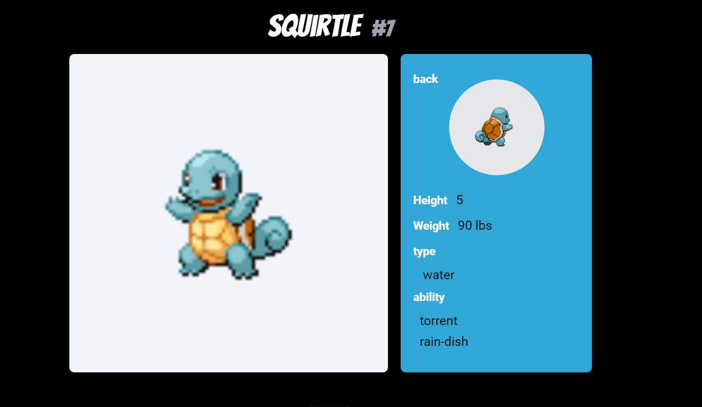

# Pokemon App 🐱‍👤

[🚀 페이지 방문하기](https://pokemon-sigma-navy.vercel.app/)

### ◽ 기획 의도 
* Pokemon API를 통해서 개별 Pokemon의 정보를 보여주는 APP.   
  * 공개된 **API를 활용**하는 방법 익히기   

### ◽ APP 서비스   
* 151종의 pokemon을 CARD 형태로 제공   
* CARD 클릭 시, 개별 pokemon의 상세 정보 제공   

   
   

### ◽ 기술 스택
 * Module Bundler : Vite
 * Library : React
 * Data Fetching : fetch( ) API
 * Styling : tailwind   
 

### ◽ 그 외  사용기술

   
